# Weierstrass 曲线

# Weierstrass equations

## **Weierstrass equations 定义:**

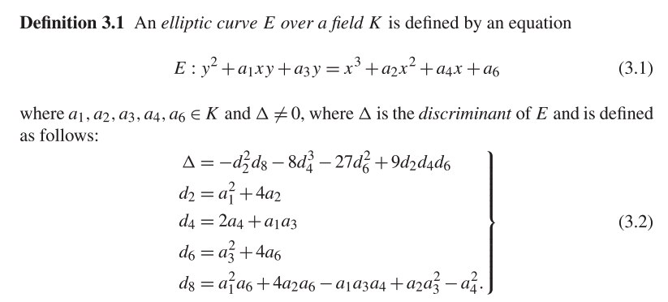

## 曲线同构定义

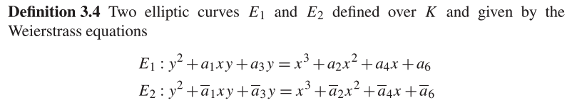

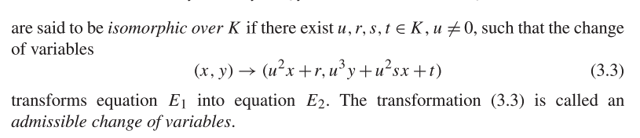

同构关系是定义在有限域 K 上的椭圆曲线集合上的等价关系。若两条椭圆曲线 E1 和 E2 在 K 上同构，则它们的 K-有理点群 E1（K）和 E2（K）也同构。

> K-有理点: K-rational points
> 在代数几何中，给定一个代数闭域 K 和一个代数簇 V（可以理解为一个几何对象），其 K 有理点是指 V 上的点集合，其中每个点都可以用 K 系数的多项式函数来表示。更具体地，对于一个代数簇 V，其 K 有理点集合是指所有在 V 上定义的、坐标用 K 数域的元素表示的点的集合。例如，在二维仿射平面上，K 有理点是指由 K 系数的多项式函数定义的点集合，它们可以表示为(x,y)，其中 x 和 y 是 K 的元素
> The L-rational points on E are the points (x, y) that satisfy the equation of
> the curve and whose coordinates x and y belong to L.
> K 有理点组相同的，即它们在该域上具有相同的点数量、相同的点结构和相同的点运算规则等。这个性质意味着我们可以在不暴露私钥的情况下将一个椭圆曲线替换为另一个同构的椭圆曲线，从而增强密码算法的安全性。

## **Weierstrass Curves 曲线分类**

根据 characteristic of K 的值进行分类

### Short Weierstrass Curves (K!=2 , 3)

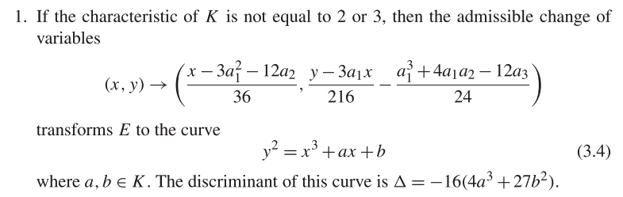

这是最常用的类型,称为 **Short Weierstrass Curves**.如 `BLS-377, BN254` 等都属于此类

> K =2 或者 K=3 的情况因不常使用,故忽略不表

## **Short Weierstrass Curves** 的坐标表示形式

曲线 E : y2 = x3 +ax +b defined over a field K whose characteristic is neither 2 nor 3

**符号定义**

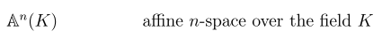

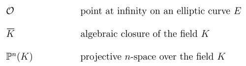

### Affine 类型

$$
表示形式:E = {(x, y) ∈ A^2(\overline K) : y^2 =x^3 +ax+b}∪{O}
$$

### 常见 Projective 类型

#### 1.Standard Projective

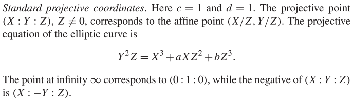

#### 2.Jacobian projective coordinates.

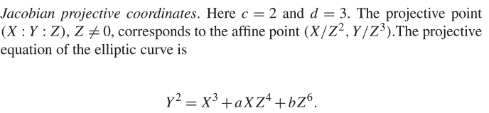

The point at infinity ∞corresponds to (1 : 1 : 0), while the negative of (X : Y : Z) is (X :−Y : Z)

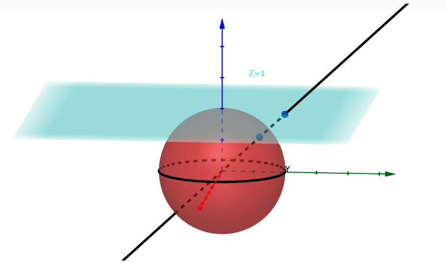

最简单的映射:

Map to Projective:$Affine(x,y)∈ A^2$（x，y）→（x：y：1）

Map back to Affine:（X：Y：Z）→（X/Z，Y/Z）

Example:

Consider $E/F_{13} : y^2 = x^3 + 5$.

在 E 上有 16 个 affine 点$(x,y)∈ A^2(F_{13})$，包括一个无穷远点 O.分别是

(2 : 0 ), (4 : 2 ), (4 : 11 ), (5 : 0 ), (6 : 0 ), (7 : 6 ),(7 : 7 ),

(8 : 6 ), (8 : 7), (10 : 2 ), (10 : 11 ), (11 : 6), (11 : 7), (12 : 2), (12 : 11)

然后 Projectify E .将$(x=X/Z,y=Y/Z)$带入$E/F_{13} : y^2 = x^3 + 5$

得到$E_P/F_{13} : Y^2Z = X^3 + 5Z^3$

将会得到 16 **类**(X,Y,Z),分别是

**O**:(0 : 1 : 0),

(2 : 0 : 1), (4 : 2 : 1), (4 : 11 : 1), (5 : 0 : 1), (6 : 0 : 1), (7 : 6 : 1),(7 : 7 : 1), (8 : 6 : 1),

(8 : 7 : 1), (10 : 2 : 1), (10 : 11 : 1), (11 : 6 : 1), (11 : 7 : 1), (12 : 2 : 1), (12 : 11 : 1).

这些类中的每一个都表示几个点$(X，Y，Z)∈ A^3(F_{13})$，其坐标满足$Y^2Z = X^3 + 5Z^3$（实际上存在 195 个这样的点，但这并不重要）。

以(2 : 0 : 1)为例,我们求一个$λ ∈ \overline K^∗,使得(2\lambda : 0\lambda : \lambda)满足Y^2Z = X^3 + 5Z^3$

如 λ =3, (6 : 0 : 3); λ =4, (8 : 0 : 4); λ =5, (10 : 0 : 5)等都满足方程$Y^2Z = X^3 + 5Z^3$

### XYZZ 类型

表示形式:  $x=X/ZZ        y=Y/ZZZ         (ZZ)^3=(ZZZ)^2$

因为针对 XYZZ 的算法有限,在这里简单总结.具体可参考 [http://hyperelliptic.org/EFD/g1p/auto-shortw-xyzz.html#scaling-z](http://hyperelliptic.org/EFD/g1p/auto-shortw-xyzz.html#scaling-z)

针对 XYZZ 类型的 Point Addition 与 Point Double

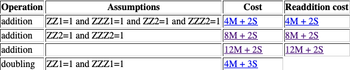

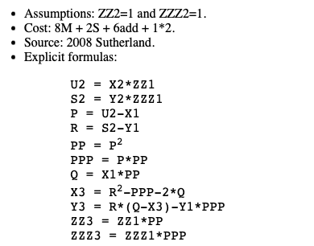
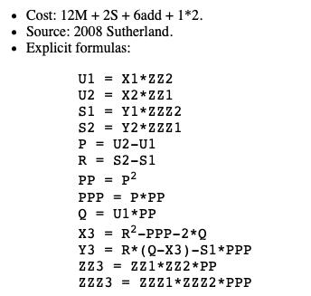

其中 SSPARK 库就分别采用了上述两种算法,针对不同情况,这里截取部分代码

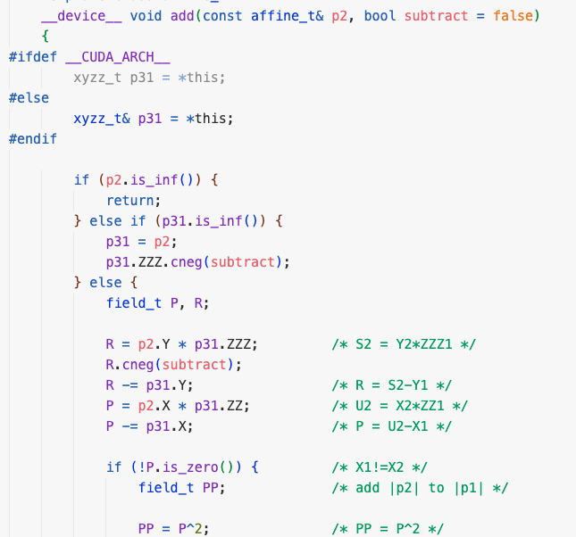
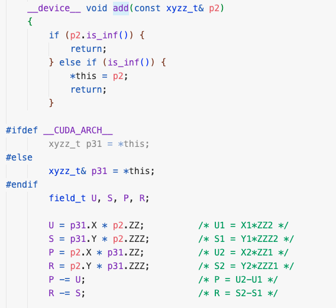

### Why Projective

#### **Filed operation** ` `**Cost **

use $\text{I, M, S, c, a}$ for field inversion, multiplication, squaring, addition, and multiplication by a constant respectively. In general, the cost of $\text{I ≫ M > S > c > a}$ . 细

考虑两类运算 **Point Double** 与** ****Point addition**** 大**

**由于 I ≫ M > S > c > a,我们只考虑 I M S 的操作次数,忽略 c a 的操作.**

以 short Weierstrass 曲线:$y^2 =x^3 +ax+b$为例

##### Affine Cost

**Point Double cost**:**2M+2S+I**

**Point addition cost**:**2M+2S+I**

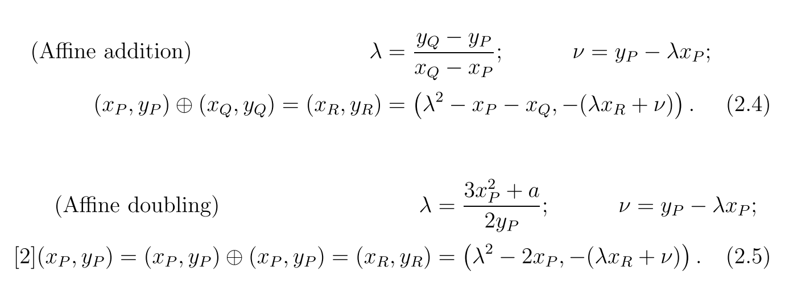

##### Standard Projective (x = X/Z,y = Y/Z) Cost

对于 **Point addition**

转换成如下形式

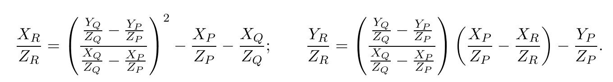

化简**,**可得

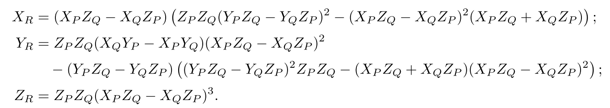

上述过程共计进行了 **12M+ 2S 次运算.**

**相较于 Affine 的 2M+2S+I.由于 I ≫ M,所以 Projective 类型的 Point addition 比 affine 类型效率要高**

同理对于**Point Double **我们执行类似的操作,

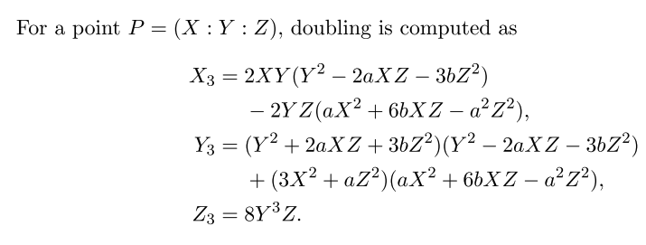

**M**: $1:X*Y;  2:X*Z;   3:2XY*(Y^2 -2aXZ-3bZ^2);4:Y*Z;  \\ 5:2YZ*(aX^2+6bXZ-a^2Z^2);  6:(Y^2 +2aXZ+3bZ^2)*(Y^2 -2aXZ-3bZ^2);  7:Y^2 * YZ$

**S**:$X^2;Y^2;Z^2$

**上述过程共计进行了 7M+3S 次运算**.

**相较于 Affine 的 2M+2S+I.由于 I ≫ M,所以 Projective 类型的 Point Double 比 affine 类型效率要高**

##### Jacobian Projective $(x = X/Z^2,y = Y/Z^3)$ Cost

**Point Double**

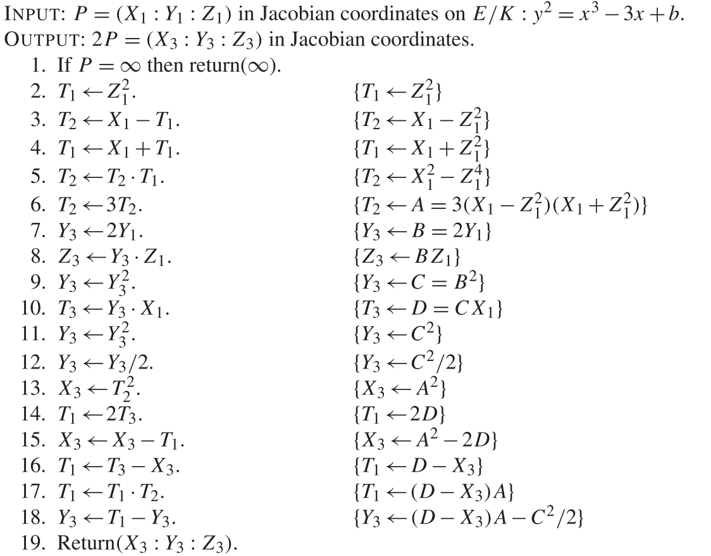

**上述过程共计进行了 4M+4S 次运算**

**Point Addition**

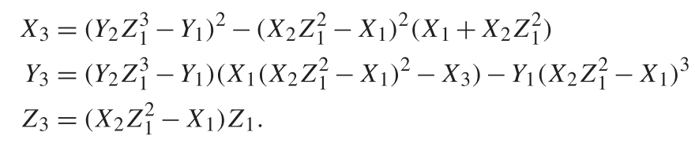

**上述过程共计进行了 12M+4S 次运算**.

##### Mixed Affine and Jacobian

但是在实际运用中,往往会采用 **Affine+Jacobian 混合的形式,**去做** Point Addition**

**如 snarkvm,****Ark****::****std****库等都采用此种类型的方法**

以曲线$E/K:y^2 = x^3 −3x +b$为例进行 **Point addition****运算**

下面给出 Mixed Affine and Projective 的算法

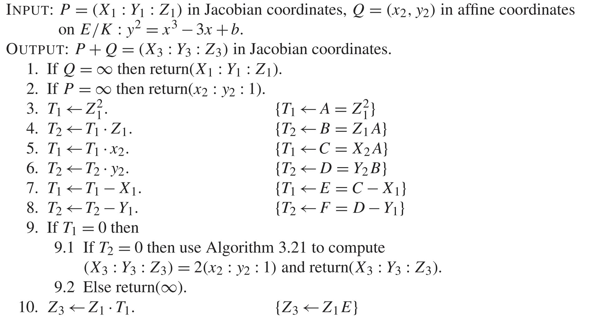

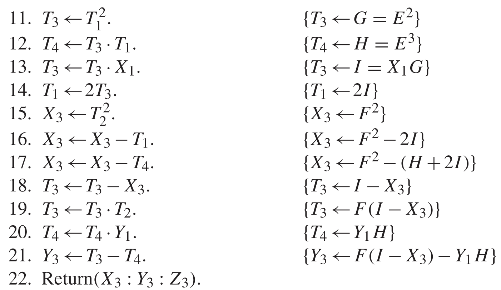

分析:**上述过程共计进行了 8M+3S 次运算**.

### 总结 Cost:Affine  Projective Jacobian  mixed 四种类型

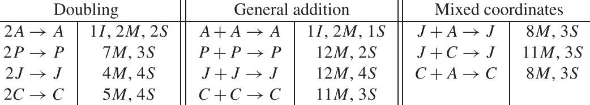

## Scalar multiplication 运算

Target:computing **kP**,where k is an integer and P is a point on an elliptic curve E defined over a field **Fq**

The binary representation of k is denoted $(k_{t−1},...,k_2,k_1,k_0)_2$, where $t ≈m =\lceil log_2q \rceil $

A 表示 **point additions****    **D 表示** point doubling**

> 注:本节除 GLV 方法外不考虑任何特殊的曲线构造,只是对常见的算法进行总结
> 针对特殊曲线,如 a=0 或者-3 等情况 会有对应的优化算法 可参考:[https://www.hyperelliptic.org/EFD/g1p/auto-shortw.html](https://www.hyperelliptic.org/EFD/g1p/auto-shortw.html) 后续会简单提到
> 针对特殊点 P(X,Y,Z) Z 的情况不同也会有不同的优化算法 后续会提到

### 1.double and add 算法

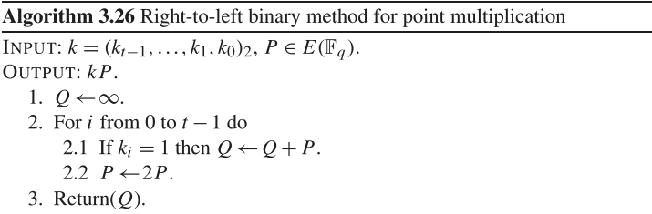

#### 算法分析:

k 的二进制表示中的 1 的预期数目为 t/2 ≈m/2，因此算法需进行约为 m/2 个 `Point additon` 与 m 个 `Point double`，记为

```
                                                                      $\frac{m}{2}A + mD$
```

#### 举例:K=151 计算 KP

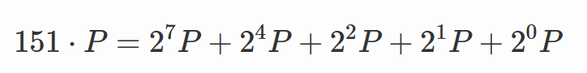

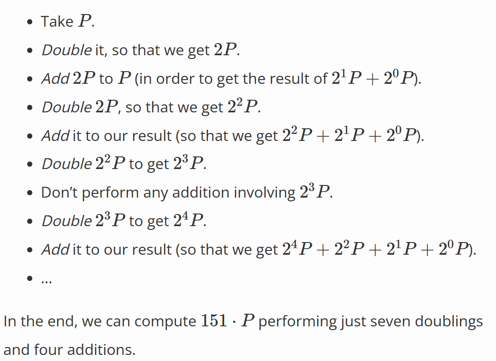

### 2.NAF(**non-adjacent form**)

参考[维基百科 NAF](https://en.wikipedia.org/wiki/Non-adjacent_form)

通过为 K 引入 a signed digit representation.假设 K 的比特位有 t 位. 则$K =\sum_{0}^{t-1}2^ik_i,where  i={(0,1,-1)}$

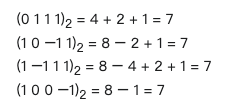

上述四个 representations 中,只有最后一个$(1,0,0,-1)_2$符合 NAF.NAF 是指没有两个连续的数字$k_i$是非零的

NAF 能够保证最小的汉明权重,即最多的 0.

> 汉明距离 与 汉明权重
> 在信息论中,汉明距离是指两个字符串对应位置不同字符的个数
> 汉明权重是指字符串中非零字符的个数

#### Convert to NAF

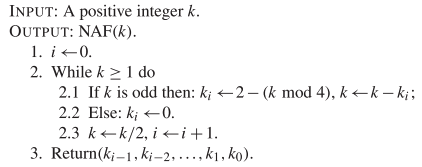

#### NAF for computing KP

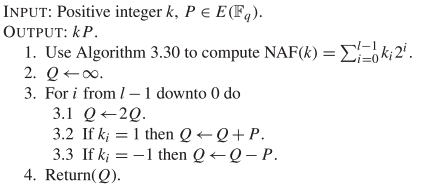

算法分析

### 3.GLV

GLV 并不能适用于通用曲线,只适合$y^2=x^3+b$ 曲线

> This optimization applies to a limited set of elliptic curves (e.g., BN254 BLS12-377).
> This optimization** does not** apply to others(e.g,BLS12-381).

#### **Goal**:

Accelerate a single point multiplication _k_ * _P_

where _k_ is a finite field over **Fq**  and _P_ is a point on an elliptic curve over** Fr**.

#### Part I:Properties of Endomorphism

For short Weierstrass curves $y^2 = x^2 + b mod     r$_ _, if there exists a cube root of unity mod r

Suppose _β_ = cube root of 1 mod q  (q = order of Fq).

_                 s_ = cube root of 1, mod r (r = order of Fr)

对于点 $P_1 = (x_0, y_0)$, where $y^2 = x^3 + b$, 点$P_2 = (x_0 * β, y_0)$ 也在曲线$y^2 = x^3 + b$上

> 由于 $β^3 = 1      and    (x_0 * β)^3 = x_0^3$.

对于一些曲线 (e.g., BN254 BLS12-377), 可以将 $P_2$ 作为 $P_1$的标量乘法表示, 其中 $P_2 = \lambda * P_1$.如果能找到这样的 s,就可以利用 PartII 的性质进行 kP 计算的优化.

但是对于一些特定的曲线(e.g., BLS12-381), **无法找到 s**.也就不能使用 GLV 的方法.

> **On a particular elliptic curve, λ and β have to be known before GLV method can be applied, where λ and β are certain cube roots of 1 in their respective fields.**

#### Part II:GLV Decomposition

##### **Overview:**

首先将 k 写成 $k = k_1 +sk_2$ mod q ,$k_1,k_2$大约是 k 的二进制长度=n 的一半

然后 kP 可以表示为$kP_1=k_1P_1+\lambda*k_2P_1=k_1P_1+k_2P_2$

由于 length   of$k_1,k_2$ are of half the bit length of k,so **一半**的 **Point Doubling** 运算可以避免

同时,计算$P_2$只需要计算$\beta x_0$即可

##### **Decomposition of ****Scalar**** k**

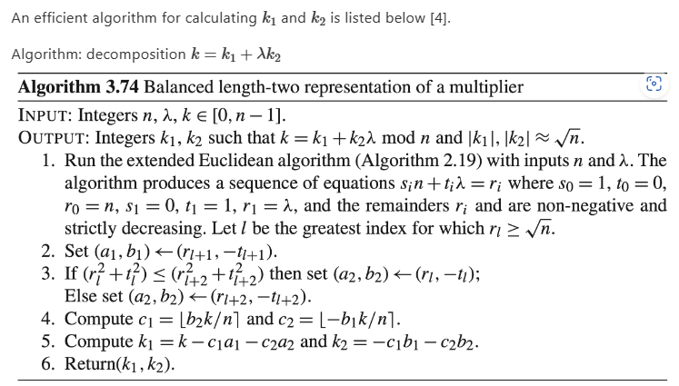

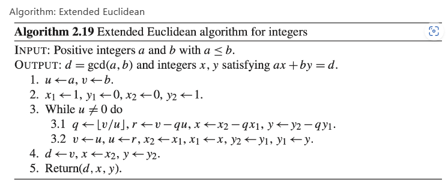

##### Compute $k_1 * P_1 + k_2 * P_2$ simultaneously

$$
k_1=(k_{1,d′−1}, ..., k_{1,1}, k_{1,0})_2    k_2=(k_{2,d′−1}, ..., k_{2,1}, k_{2,0})_2 d
$$

$k_{1,i},k_{2,i} $ is a bit string of length _w.  _$d'=ceil(\frac{n}{2^w})$

1. For i in (d'-1,0)

   1. $$
      R = [2^w]R
      $$
   2. $$
      R = R + (k_{1,i}P_1 + k_{2,i}*P_2)
      $$
2. Return R

算法分析:

### 4.Montgomery

5.Sliding window

## 常见曲线的基本参数

**BLS12377 曲线参数** (BLS12 系:a=0)  [参以太坊](https://eips.ethereum.org/EIPS/eip-2539) 以及 [Snarkvm](https://github.com/AleoHQ/snarkVM/tree/testnet3/curves)

double and add 方法 :大端排序为例

实例:Snarkvm  Ark::std 库与 snarkvm 一致

输入为 scalar 和 afiine 类型的 point

输出为 projective 类型

Double and add 算法

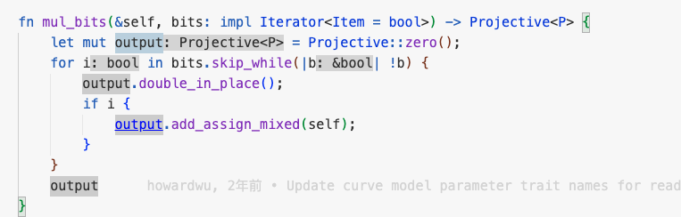

add_assign_mixed()方法原理如下:

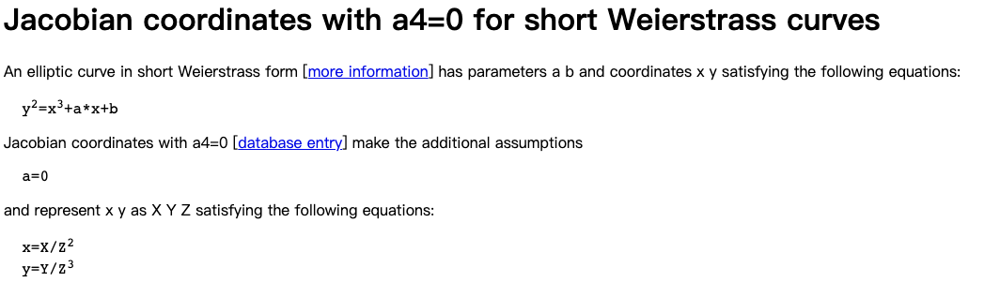

snarkvm 中先把 affine 类型转为 Projective 类型,采用下面的方法进行 projective 类型的 point 加法运算

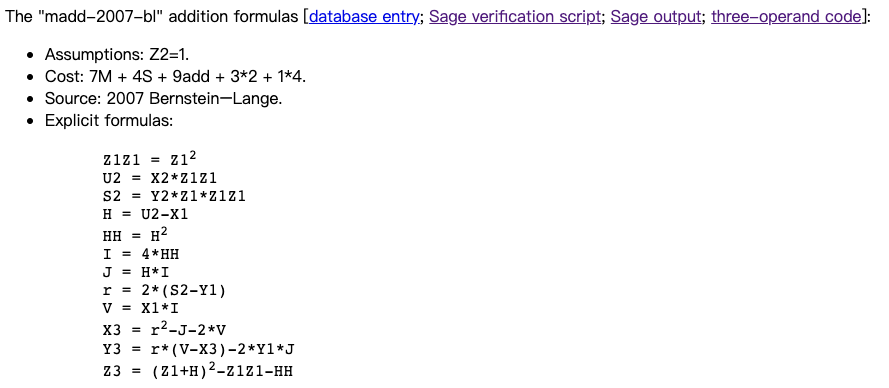

Ark::R1cs-std 库

to affine 函数

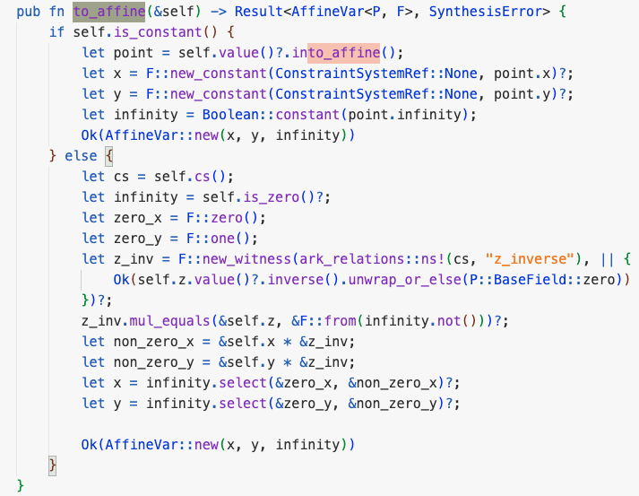

混合加函数

算法原理

double 算法

BLS12-377 曲线

基本参数

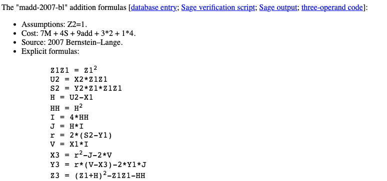

参考

《Guide to Elliptic Curve Cryptography 》

《Pairing for Beginners》

[椭圆曲线曲线动态效果](https://andrea.corbellini.name/ecc/interactive/modk-add.html)

[椭圆曲线-Andrea](https://andrea.corbellini.name/2015/05/23/elliptic-curve-cryptography-finite-fields-and-discrete-logarithms/)
